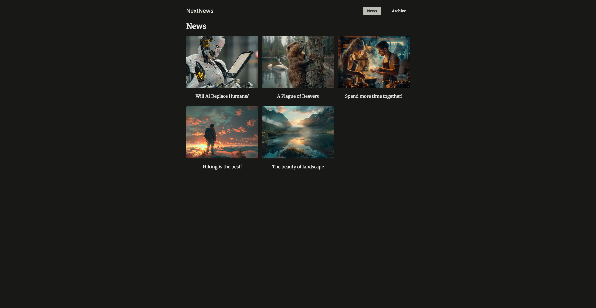

# News Site Next.js Demo

This is a basic demo project that goes deeper into Next.js routing. It demonstrates:

- File-based routing
- Dynamic routes
- Layouts and nested layouts
- Modal overlays
- Parallel routes
- Intercepting routes
- Basic middleware
- Route groups

## Screenshot



## Getting Started

1. Install dependencies:
   ```bash
   npm install
   ```
2. Run the development server:
   ```bash
   npm run dev
   ```
3. Open [http://localhost:3000](http://localhost:3000) in your browser.
